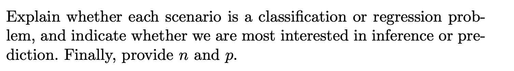
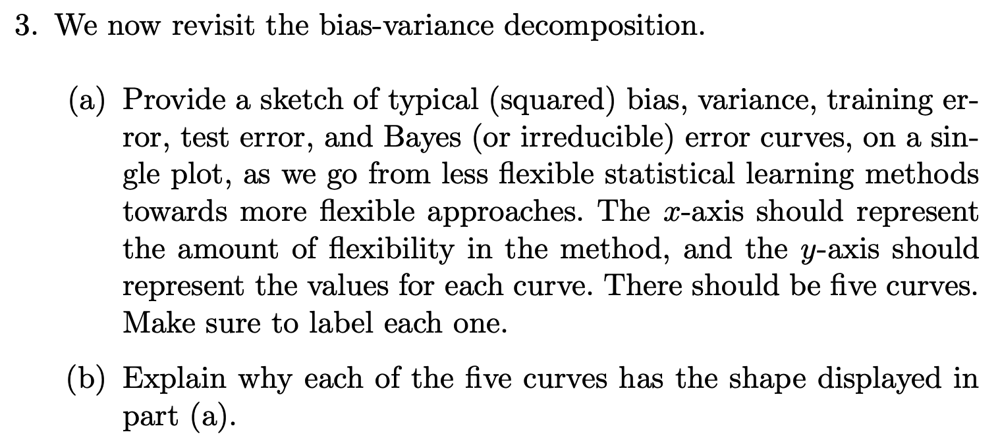

# Question 1


## a)

Flexible statistical Learning method is **BETTER**

A flexible statistical learning methods, such as random forest tree, neural network, are able to capture complex relationship between predictors and response.

## b)

A flexible statistical learning method is **WORSE**

A flexible statistical learning methods, maybe suffer from **OVERFITTING** problem, which can result in poor generalization performance.

Inflexible methods can also provide interpretable models that can be useful for understanding the **relationships** between predictors and the response variable.

## c)

A flexible statistical learning method is **BETTER**

A flexible statistical learning methods like tree-based models, neural networks, and nonparametric regression methods have the ability to capture non-linear relationships and interactions between variables, which can be difficult or impossible for inflexible methods like linear regression or logistic regression.

## d)

A flexible statistical learning method is **WORSE**

A flexible statistical learning methods may fit the noise(outier) and cause high variance.

# Question 2



## a)


Regression Problem

Inference Problem

n = 500

p = 3 (profit, number of employees, industry)

## b)


Classification Problem

Prediction Problem

n = 20

p = 13(price charged for the product, marketing budget, competition price, ten other variables)

## c)


Regression Problem

Prediction Problem

n = 52 ( 52 weeks in 2012)

p = 3 (% change in the US market, % change in the British market, % change in the German market)

# Question 3



## a)

# {width="808" height="415"}

## b)

Bias: Bias refers to the error that is introduced by approximating a real-life problem with a simpler model. High bias means UNDERFITTING, which means fail to capture the underlying patterns. As the flexibility of model increases, the bias **decreases**.

Variance: Variance refers to the error that is introduced by the model;s sensitivity on the fluctuations in the training data. High variance means OVERFITTING, where the model fits the training data too closely and fails to generalize to new data. As the flexibility of model decrease, the variance **increase** as well

Training Error: With the flexibility of the model increases, the training error tends to decrease as the model become more capable of fitting the training data.

Test Error: With the flexibility of the model increases, the test error initially decreases because the bias decrease more quickly, later the variance increase more quickly then the bias decrease. So the test error increase.

Bayes: It is the ir-reducible error, which is the lowest error that can be achieved for a given problem. As the flexibility of the model increase, the Bayes error will remain constant, as it is determined by the inherent complexity of the problem, rather than the model's flexibility.

# Question 4


## a)

1.  Credit Scoring: Used by banks and other financial institution to assess the creditworthiness of load application.

    Response variable: Whether the load applications is likely to default to loan or not

    Predictors:

    -   income

    -   credit history

    -   employment status

    -   ...

    It is the prediction problem

2.  Medical Diagnosis: Used by healthcare providers to diagnose disease status based on patient symptoms and medical history

    Response Variable: The patient; disease status

    Predictors:

    -   age

    -   gender

    -   medical history

    -   ...

    It is the prediction problem

3.  Spam Email Filtering: Used by email service provider to filter out unwanted emails from the user's inbox

    Response Variable: Whether the email is Spam

    Predictors:

    -   email sender:

    -   subject line

    -   attachments

    -   ...

    It is the prediction problem

## b)

1.  House Price Prediction:

    Response: Hose Price

    Predictors:

    -   House Size

    -   House Location

    -   House Age

    -   ...

    Prediction Problem

2.  Sales Forecasting:

    Response: sales volume

    Predictors:

    -   advertising expenditure

    -   pricing strategy

    -   seasonality

    -   ....

    Prediction Problem

3.  Medical Cost Estimation:

    Response: cost of medical treatment

    Predictors:

    -   age

    -   gender

    -   medical history

    -   ...

    Prediction Problem

## c)

1.  Customer Segmentation: Used by businesses to group customers based on their characteristics. To tailor marketing strategies and product offerings to each segment
2.  Image Segmentation: Used in Computer Vision to group pixels in an image into homogeneous regions based on their color or texture. The goal is to identify regions in an image that have similar properties and can be treated as a seperateentity of further processing
3.  Crime Hotspot Analysis: Used by law enforcement agencies to identify areas with a high frequency of crime incidents. The goal is to identify spatial clusters of crime incidents and allocate resources and law enforcement measures to reduce crime rates in these hotspots

# Question 5


Advantages:

1.  capture complex and non-linear relationships between the predictors and the response
2.  provide high accuracy on the training data

Disadvantages:

1.  Prone to overfitting
2.  Computationally expensive and require a large number of parameter

A more flexible approach be preferred when:

1.  True relationship between the predictors and the response is complex and non-linear
2.  The goal is to achieve high accuracy
3.  Focus on Prediction rather than inference

A less flexible approach be preferred when:

1.  true relationship between the predictors and the response is simple and linear
2.  When the sample size is small
3.  The Interpretation of the model is a primary concern, and is inference problem

# Question 6


A parametric statistical learning approach assumes a specific functional form for the relationship between the predictors and the response, while non-parameter statistical learning approach does not assume a specific functional form for the relationship between predictors and the response variable, and estimate the relationship directly from the data

Advantages of a parametric approach:

1.  More interpretable and easier to understand
2.  Require less data to estimate their parameters
3.  Provide more stable and precise estimates of the relationship between the predictors and the response

Disadvantages of a parametric approach:

1.  May not capture complex or non-linear relationship between the predictors and the response.
2.  Are sensitive to model misspecification, which occurs when true relationship between the predictors and the response deviates from the assumed functional form
3.  May be biased if the assumptions of the model are violated or the data is not representative the population

# Question 7


## a)

Euclidean Distance:

Distance = sqrt( (x2-x1) \^ 2 + (y2-y1) \^ 2 )

| Obs | Distance \^ 2 | Y     |
|-----|---------------|-------|
| 1   | 9             | Red   |
| 2   | 4             | Red   |
| 3   | 10            | Red   |
| 4   | 5             | Green |
| 5   | 2             | Green |
| 6   | 3             | Red   |

## b)

Green

## c)

Red

## d)

Small. A small K would be flexible for a non-linear decision boundary.

# Question 8

## a)

```{r}
college <- read.csv("College.csv")
```

## b)

```{r}
head(college)
# First Column just the name of each university, need remove this columns
# Store the Row Name first
rownames(college) <- college[,1]
# View(college)
# Elimate the first column
college <- college[, -1]
View(college)
```

## c)

```{r}
summary(college)
college[,1] = as.numeric(factor(college[,1]))
pairs(college[,1:10])
```

```{r}
# iii
plot(college$Outstate, college$Outstate)
```

```{r}
Elite <- rep("No", nrow(college))
Elite[college$Top10perc > 50] <- "Yes"
Elite <- as.factor(Elite)
college <- data.frame(college, Elite)
summary(college$Elite)
plot(college$Outstate, college$Elite)
```

```{r}
par(mfrow=c(2,2))
hist(college$Apps)
hist(college$perc.alumni, col=2)
hist(college$S.F.Ratio, col=3, breaks=10)
hist(college$Expend, breaks=100)
```

```{r}
par(mfrow=c(2,2))
plot(college$Outstate, college$Grad.Rate)
# High tuition correlates to high graduation rate.
plot(college$Accept / college$Apps, college$S.F.Ratio)
# Colleges with low acceptance rate tend to have low S:F ratio.
plot(college$Top10perc, college$Grad.Rate)
# Colleges with the most students from top 10% perc don't necessarily have
# the highest graduation rate. Also, rate > 100 is erroneous!
```

# Question 9

## a)

```{r}
# Load Data 
Auto <- read.csv("Auto.csv", header = T, na.strings = "?")
# Check if their is Na and remove the NA value
if (any(is.na(Auto))){
  Auto <- na.omit(Auto)
}
dim(Auto)
summary(Auto)
```

**Quantitative**: mpg, cylinders, displacement, horsepower, weight, acceleration, year

**Qualitative**: name, origin

## b)

```{r}
sapply(Auto[,1:7], range)
```

## c)

```{r}
print(sapply(Auto[,1:7], mean))
print(sapply(Auto[,1:7], sd))
```

## d)

```{r}
# Remove the 10th and 85th
newAuto <- Auto[-(10:85),]
# Check If remove success
dim(newAuto) == (dim(Auto) - c(76,0))
```

```{r}
sapply(newAuto[, 1:7], range)
```

```{r}
sapply(newAuto[, 1:7], mean)
```

```{r}
sapply(newAuto[, 1:7], sd)
```

## e)

```{r}
library(corrgram)
library(corrplot)
corrgram(Auto, order=TRUE, 
         panel = panel.pie, 
         text.panel = panel.txt
         )
```

## f)

all predictors have some correlation with mpg

# Question 10

## a)

```{r}
library(MASS) # Data Set Also in MASS
head(Boston) 
dim(Boston) # 506, 14
```

## b)

```{r}
pairs(Boston)
```

## c)

```{r}
plot(Boston$age, Boston$crim)
# Older homes, more crime
plot(Boston$dis, Boston$crim)
# Closer to work-area, more crime
plot(Boston$rad, Boston$crim)
# Higher index of accessibility to radial highways, more crime
plot(Boston$tax, Boston$crim)
# Higher tax rate, more crime
plot(Boston$ptratio, Boston$crim)
# Higher pupil:teacher ratio, more crime
```

## d)

```{r}
par(mfrow=c(1,3))
hist(Boston$crim[Boston$crim>1], breaks=25)
# most cities have low crime rates, but there is a long tail: 18 suburbs appear
# to have a crime rate > 20, reaching to above 80
hist(Boston$tax, breaks=25)
# there is a large divide between suburbs with low tax rates and a peak at 660-680
hist(Boston$ptratio, breaks=25)
# a skew towards high ratios, but no particularly high ratios
```

## e)

```{r}
dim(subset(Boston, chas == 1)) # 35
```

## f)

```{r}
median(Boston$ptratio) # 19.05
```

## g)

```{r}
t(subset(Boston, medv == min(Boston$medv)))
```

## h)

```{r}
dim(subset(Boston, rm > 7)) # 64 14
# 64
dim(subset(Boston, rm > 8)) # 13 14
# 13
summary(subset(Boston, rm > 8))
summary(Boston)
```
